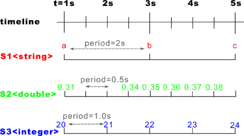

[](https://travis-ci.org/ESROCOS/tools-stream_aligner) [](https://opensource.org/licenses/BSD-3-Clause)

# ESROCOS Stream Aligner

Stream Aligner and Time stamp utility for the ESROCOS framework. This utility is
only useful in the dataflow of component-based systems, this is in port-driven
functions of [TASTE](https://taste.tuxfamily.org). The processing is done
asynchronously: components process data as it arrives. Since different
processing chains have different computation times, it means that our carefully
timestamped data will most probably arrive out-of-order at the components that
need it.

Let’s see, as an example, the following processing chain:


In this chain, sensors are fused through two paths. One path processes lidar
data to remove outliers and body parts (laser filter). In another path, a stereo
camera rig is used to generate a separate point clouds. The two informations are
then merged to form a pointcloud that is represented in a frame that is centered
on the body, but aligned to the world (i.e. a tabletop would look horizontal
even if the robot’s body is on an incline). To achieve this, a motion tracker
gives the pose of the body in the reference frame.

## Stream Aligner Principles
The Stream Aligner ensures that data is processed in order by (1) queueing
timestamped data, and (2) calling registered callbacks in the order of the
timestamps. The general principle is therefore that:

* one callback is registered for each data stream.
* data is pushed as it arrives in the corresponding streams. The leading
assumption is that, on each stream, the timestamps are monotonous (they don’t go
back in time).
* the respective callbacks get called when it is time to process the relevant
samples. This is done only when the stream aligner determined that no sample
from other streams can arrive with an earlier timestamp then the one that is
being passed to a callback.

## Period, latency and stream aligner timeout
Let’s look at the example of the laser filter again:


If, as this diagram shows, the laser filter starts processing as soon as the
lidar sample arrives, it means that the stream aligner would, in this case, have
determined that it is impossible that a motion tracker sample arrives in between
the first motion tracker and first lidar samples.

With no additional information, however, the stream aligner would have to wait
that another sample arrives on the motion tracker before processing the first
laser sample:


Which builds up latency...To avoid this, the stream aligner allows to set a
period parameter on each stream. This period parameter (which is also called
lookahead in event-based systems) is the time after a sample in which there is a
guarantee that no other sample arrives. It is called period in the stream
aligner as it is the value of the input periods, for periodic inputs such as
common robotic sensors. When visualizing the period, the above example looks
therefore like:


---
**NOTE**

Because processing based on the stream aligner is based on the fact that samples
are passed in-order, the stream aligner must drop samples that arrive “in the
past”, i.e. that arrive with an earlier timestamp that the last sample “played”
by the stream aligner. So, it is better to give a period that is lower than the
actual sensor period so that the aligner does not drop samples unnecessarily.

---

In order to not wait forever for samples that will never arrive (lost samples),
the stream aligner also allows to set a timeout parameter, which is the highest
latency that the aligner would allow to build up. When the latency induced by
the stream aligner is higher than this value, the aligner starts playing queued
samples regardless of the fact that, in principle, some samples should arrive on
the other streams. If these samples do arrive anyway, they will therefore get
dropped. This parameter is therefore a trade-off between the maximum latency
that the processing chain can accept and how exact the result needs to be.

## Example of Usage
There is an example of usage in the test folder
[here](test/test_example_usage.cpp).
The example has three streams, one for `string`, one for `double` and a third
one for `integer` type.  The Stream Aligner processes the samples and executes
them in the right order according to the given information. The example is
graphically depicted in the following:



Right configuration values are given in order for the Stream Aligner to
interpret the timing. The first number to consider is the `NUMBER_OF_STREAMS`
because the Stream Aligner is a static and fully templated class. The following
values are `WINDOW_SIZE` and samples period (e.g., `S1_PERIOD`) in order to size
the circular buffer. Those values define how many samples you want to store in
the buffer. Once these values are defined, the priority (optional) can be set.
Normally, the stream with highest frequency has the highest priority. The code
with the configuration values is here:

```cpp
/** Number of streams or provided interfaces (config value) **/
#define NUMBER_OF_STREAMS 3

/** Windows size in seconds **/
#define WINDOW_SIZE 5

/** Stream periods (configuration value) **/
#define S1_PERIOD 2.0
#define S2_PERIOD 0.5
#define S3_PERIOD 1.0

/** Stream aligner timeout (config value)
* this defines the highest larency **/
#define TIMEOUT S1_PERIOD //the lowest period

/** Buffer size as a computation of timeout and period scaled witha factor
 * typical two in order to store two cycles of timeout**/
#define BUFFER_SIZE_S1 CEILING(WINDOW_SIZE, S1_PERIOD)
#define BUFFER_SIZE_S2 CEILING(WINDOW_SIZE, S2_PERIOD)
#define BUFFER_SIZE_S3 CEILING(WINDOW_SIZE, S3_PERIOD)

/** When samples have the same time, the priority defines which one to choose at
 * first **/
#define HIGH_PRIORITY 1
#define MEDIUM_PRIORITY 2
#define LOW_PRIORITY 3
```

The stream aligner object can now be instantiated. The timeout
is the maximum time the Stream Aligner will wait for a sample in order to
consider that sample valid to play with the rest of samples in the stream. The
timeout is set and the streams are registered in the following:

```cpp
/**The aligner has a NUMBER_OF_STREAMS fixed size **/
stream_aligner::StreamAligner<NUMBER_OF_STREAMS> aligner;
const size_t N_S1 = static_cast<size_t>(BUFFER_SIZE_S1);
const size_t N_S2 = static_cast<size_t>(BUFFER_SIZE_S2);
const size_t N_S3 = static_cast<size_t>(BUFFER_SIZE_S3);

/** Set the timeout **/
aligner.setTimeout(base::Time::fromSeconds(TIMEOUT));

/** Each stream can have a different size according to the period **/
/** callback, period_time, (optional) priority **/
/** The stream with the highest frequency should have the highest priority **/
int s1 = aligner.registerStream<std::string, N_S1>(&string_callback, base::Time::fromSeconds(S1_PERIOD), LOW_PRIORITY);
int s2 = aligner.registerStream<double, N_S2>(&double_callback, base::Time::fromSeconds(S2_PERIOD), HIGH_PRIORITY);
int s3 = aligner.registerStream<int, N_S3>(&int_callback, base::Time::fromSeconds(S3_PERIOD), MEDIUM_PRIORITY);
```

Now, we can start pushing samples in the streams. Normally, pushing and popping
data (step method) will appear in the same loop. However, for simplicity we
first push the samples and then pop all the samples in that order. The following
code push four samples in the first stream (stream1), but three are pushed since one
sample arrives late on time:

```cpp
/** Push samples in stream 1 **/
aligner.push<std::string, N_S1>(s1, base::Time::fromSeconds(1.0), std::string("a"));
aligner.push<std::string, N_S1>(s1, base::Time::fromSeconds(3.0), std::string("b"));
aligner.push<std::string, N_S1>(s1, base::Time::fromSeconds(2.0), std::string("k")); //arrive in the past
aligner.push<std::string, N_S1>(s1, base::Time::fromSeconds(5.0), std::string("c"));
```

We push samples in stream2 and stream3:

```cpp
/** Push samples in stream 2 **/
aligner.push<double, N_S2>(s2, base::Time::fromSeconds(1.0), 0.3186);
aligner.push<double, N_S2>(s2, base::Time::fromSeconds(1.5), 0.3265);
aligner.push<double, N_S2>(s2, base::Time::fromSeconds(2.0), 0.3386);
aligner.push<double, N_S2>(s2, base::Time::fromSeconds(2.5), 0.3405);
aligner.push<double, N_S2>(s2, base::Time::fromSeconds(3.0), 0.3589);
aligner.push<double, N_S2>(s2, base::Time::fromSeconds(3.5), 0.3656);
aligner.push<double, N_S2>(s2, base::Time::fromSeconds(4.0), 0.3758);

/** Push samples in stream 3 **/
aligner.push<int, N_S3>(s3, base::Time::fromSeconds(1.0), 20);
aligner.push<int, N_S3>(s3, base::Time::fromSeconds(2.0), 21);
aligner.push<int, N_S3>(s3, base::Time::fromSeconds(3.0), 22);
aligner.push<int, N_S3>(s3, base::Time::fromSeconds(4.0), 23);
aligner.push<int, N_S3>(s3, base::Time::fromSeconds(5.0), 24);
```
We can now run the example test and see the output, but first we have to add the
`step()` method to pop the samples and execute the call_back function in the
right order. The console output of the program would be:

```console
root@taste#️ ./build/test/example-usage
double last_sample[19700101-00:00:01:000000]: 0.318600
Integer last_sample[19700101-00:00:01:000000]: 20
String last_sample[19700101-00:00:01:000000]: a
Double last_sample[19700101-00:00:01:500000]: 0.326500
Double last_sample[19700101-00:00:02:000000]: 0.338600
Integer last_sample[19700101-00:00:02:000000]: 21
Double last_sample[19700101-00:00:02:500000]: 0.340500
Double last_sample[19700101-00:00:03:000000]: 0.358900
Integer last_sample[19700101-00:00:03:000000]: 22
String last_sample[19700101-00:00:03:000000]: b
Double last_sample[19700101-00:00:03:500000]: 0.365600
Double last_sample[19700101-00:00:04:000000]: 0.375800
Integer last_sample[19700101-00:00:04:000000]: 23
```

We can see that the Stream Aligner did not process the sample that arrived late
in stream1. In addition, the Stream Aligner does not process the last samples in stream1
and stream2 because it is waiting for a sample in the stream3. Until the sample
is not pushed in stream3, the `step()` method cannot process the rest of samples:

```cpp
/** Push the sample that is missing **/
aligner.push<double, N_S2>(s2, base::Time::fromSeconds(4.5), 0.3858);

/** Keep processing the samples **/
while(aligner.step());
```

This create the following ouput when further processing the samples:
```console
Double last_sample[19700101-00:00:04:500000]: 0.385800
Integer last_sample[19700101-00:00:05:000000]: 24
String last_sample[19700101-00:00:05:000000]: c
```
These samples are bound together according to the timeout. In addition, it is
important to see the effect of the priority values. A low number entails a high
priority. This is visible in the order of processing sample `24` and `c`, from
stream2 and stream3, which both have the same timestamp of `5 seconds`.
Similar effect occurred in processing samples `0.3186` and `20`
from stream1 and stream2 at timestamp `1 second`.


